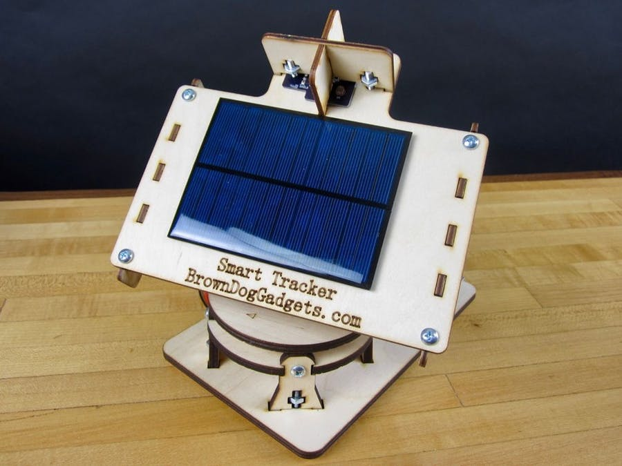
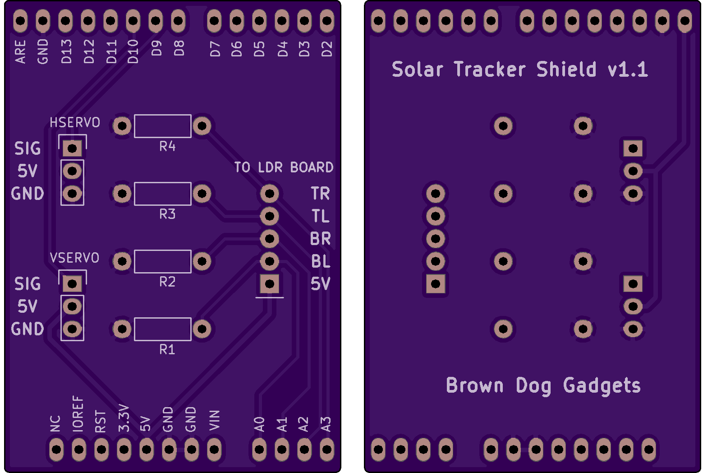
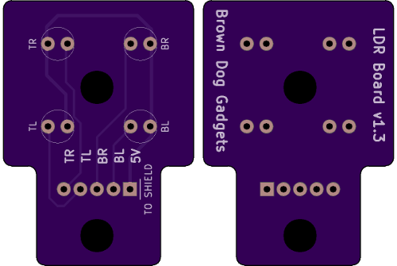
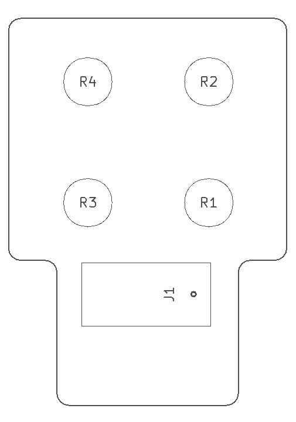
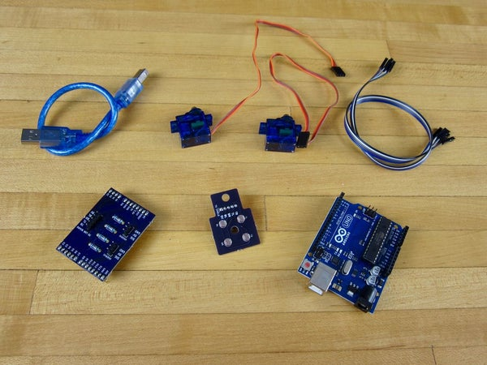
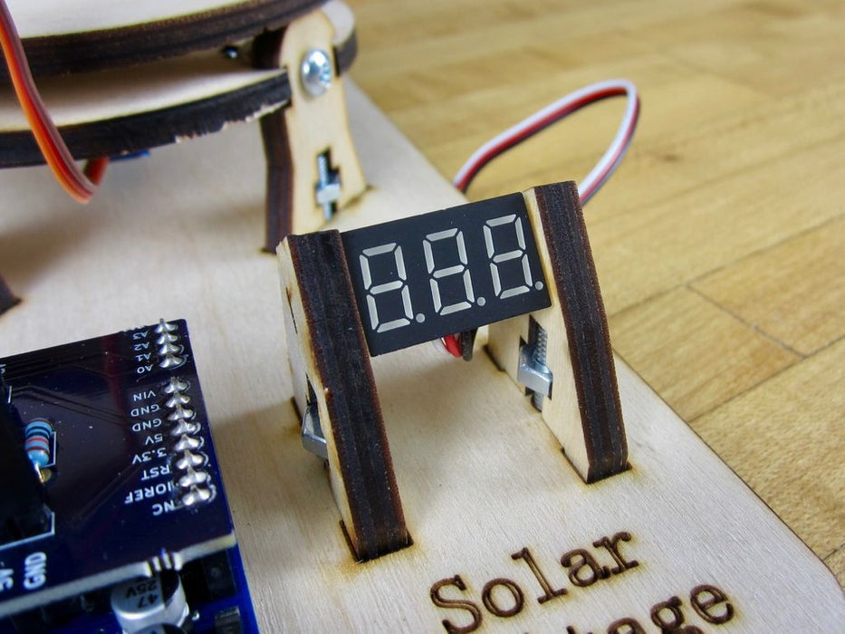
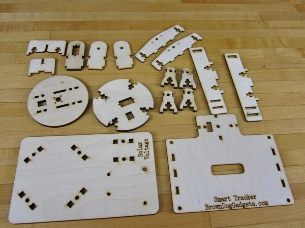

# Projeto: Painel Solar + Detecção da Posição do Sol

# Descrição

  

  !Projeto De Costas](Imagens/Imagens Gerais/costas.jpg)

  O projeto consiste em um painel solar móvel que, por meio de um microcontrolador Arduino Uno, detecta onde há maior incidência de luz solar e se move para tal ponto. Tal projeto pode ser usado, por exemplo, para alimentar baterias de pequeno porte do aeromodelismo, como baterias de liPo de drones. O projeto ainda conta com um display de 7 segmentos que mostra o nível tensão da placa solar.

## No futuro

  No futuro, espero aplicar à esse projeto uma integração de interface com internet, utilizando um raspberry Pi, que disponibilizaria um diagnóstico de como está funcionando a placa solar (dados como potência, correntes, tensão da placa e, se houver uma bateria sendo carregada, o nível de carga da mesma).
  É importante ressaltar também que essa versão com uma placa solar pequena é feita didaticamente e representa um sistema real de alimentação por placas solares de grande porte em uma casa ou um carro elétrico, por exemplo.

### Pré-requisitos

  Primeiramente, faz-se necessário:
  - Arduino Uno e sua IDE
  
  - 4 Servo-Motores (2 x 9G)
  
  - 1 Shield Arduino Personalizado (cabeças de pinos e resistores de 10000 ohm)
  
  
  
  
  
  
  - 1 Shield personalizado para segurar os sensores (Sensor Holder PCB) Obs: 4 Sensores LDR (PHOTOCELL 3K-11K OHM 5.10MM)
  
  
  
  
  
  
  

  - 4 Conjuntos de Cabo Jumper (Fêmea-Fêmea)
  
    
    
  
  - Voltímetro de LED
    
      
  
  - Cédula Solar (6V 200mA)
  
  - Acesso a uma impressora 3D (ou Cortadora à laser ou Fresadora Router CNC) para obtenção das peças estruturais.
  
    
  

### Instalação

  Em primeiro lugar, deve-se posicionar as peças de madeira individuais, deve-se seguir o passo a passo [deste vídeo do Youtube](https://www.youtube.com/watch?v=ehgPL8rRmDY) para que se construa a parte estrutural do projeto. 

A partir daí, é hora de realizar a ligação elétrica, conforme diagrama feito no fritzing, do arduino com o resto do circuito, além de fazer a conexão do voltímetro de LED.

## Realizando Testes

Existe apenas um teste que deve ser feito para ver se o sistema está funcionando.
Utilize uma lanterna para simular o sol sob os sensores LDR, faça um movimento horizontal ou vertical e observe se o painel solar se movimento seguindo a fonte de luz.

No geral, se algo não funciar, as seguintessituações podem ter ocorrido:

- Jumpers conectados errado, tenha certeza que os sensores estão indo na ordem certa para o shield. (Nesse caso o painel não lhe seguiria na direção certa)

- Servo-Motor estragado. (Nesse caso você ouvirá um barulho de metal vindo de dentro do motor)

- Arduino pode não estar ligado à um cabo de alimentação USB (Nesse caso o Arduino não fará nada)

- Código não teve seu upload para dentro do Arduino. (Nesse caso tambem o Arduino não fará nada)

## Ônus e Bônus do Projeto

Por ser um projeto didático e que representa uma possível aplicação em painéis solares de grande escala, a bateria alimentada pelo painel solar atual (6v 200mA) demora muito tempo para chegar a carga total.

Contudo, ao se pensar que o tempo entre o nascer e o por do sol é muito grande, os servo-motores gastarão pouca energia para mover o painel uma unica vez de um lado para o outro.

Na exemplificação dessa aplicação na vida real, as baterias domiciliares de grande porte e integradas a um sistema de painéis solares, como as produzidas pela Tesla Motors, normalmente ficam o dia inteiro carregando e podem ser usadas para alimentar o chuveiro elétrico na parte da noite, ou alimentar um carro elétrico.

## Créditos

O projeto PCB do Arduino Shield e do Sensor Holder, somados com seus diagramas, foram confeccionados por [Brown Dog Gadgets
](https://github.com/BrownDogGadgets), a quem tiro meu chapéu. Este também responsável pelo código inicial ".ino" e pela paciente e clara explicação em seu projeto [Dual Axis Solar Tracker](https://github.com/BrownDogGadgets/SolarTracker/tree/master/Dual%20Axis%20Tracker).
Obs: Ele também possui uma [loja](https://www.browndoggadgets.com/collections/new-solar/products/dual-axis-smart-solar-tracker).

* etc

